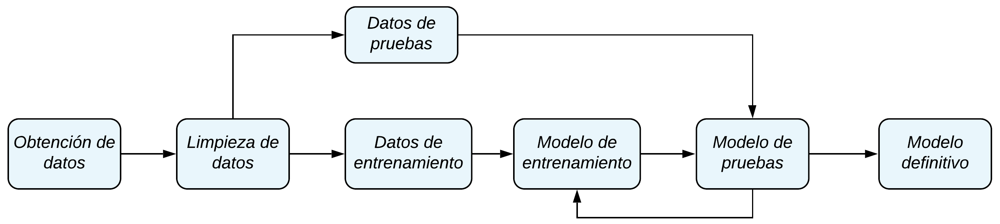

# Machine Learning
✏️ Apuntes y conceptos básicos del🤖Machine Learning 🔥🐉 - ¡Que debes saber!

## Temario 📘 

- **Entornos** (Instalación de Anaconda, Jupyter Notebook Online) 

- **Curso básico de Python** (Números, cadenas, listas, diccionarios, tuplas, conjuntos, operaciones, función range, map, filter, bucles, for y while, y funciones lambda) 

- **Módulo Numpy** (Numpy con listas, funciones arange, ones, zeros, linspace, números aleatorios y arrays de 1 y 2 dimensiones) 

- **Módulo Pandas** (Series, Data Frames, selección de datos, modificación de filas, tratar valores nulos, agrupación por columnas, combinar Data Frames, Merge y Join en Data Frames, leer ficheros tipo excel, leer páginas web HTTML, grabar Data Frames, en tablas SQL y gráficos con pandas) 

- **Módulo Matplotlib** (gráficos, multigráficos, tamaño del gráfico, crear 2 gráficos en la misma figura, color del gráfico, tipo de línea y marcadores)

## ¿Qué es el Marchine Learning?

- Machine learning o aprendizaje de máquinas o aprendizaje automático, es el subcampo de las ciencias de la computación y una rama de la inteligencia artificial, cuyo objetivo es desarrollar técnicas que permitan que las computadoras aprendan.

- Machine learning es un método de análisis de datos que automatiza la contrucción de un modelo analítico.

- Machine learning permite a los ordenadores encontrar soluciones a problemas, sin ser explíitamente programados para ello, gracias al uso de algoritmos, que aprenden de los datos.

### Procesos de Machine Learning

### Tipos de algoritmos de Machine Learning

- **Aprendizaje supervizado**: Este algoritmo necesita datos previamente etiquetados (solucinados) para aprender a realizar el trabajo. En base a estos datos, el algoritmo es capaz de aprender a resolver problemas futuros similares.

- **Aprendizaje no supervizado**: Este algoritmo necesita indicaciones previas, que le enseñan a comprender y analizar la información, para resolver problemas futuros similares. No necesita datos previamente etiquetados.

- **Aprendizaje de refuerzo**: Este algoritmo aprende por su cuenta, en base de unos conocimientos previamente introducidos y a la práctica que realiza sobre los problemas aprendiendo en función del éxito o fracaso que obtiene al resolver los problemas.